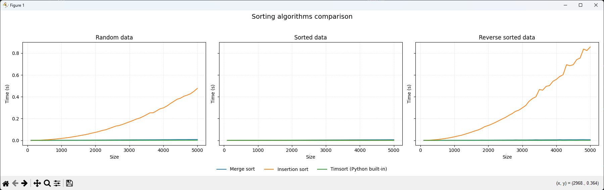
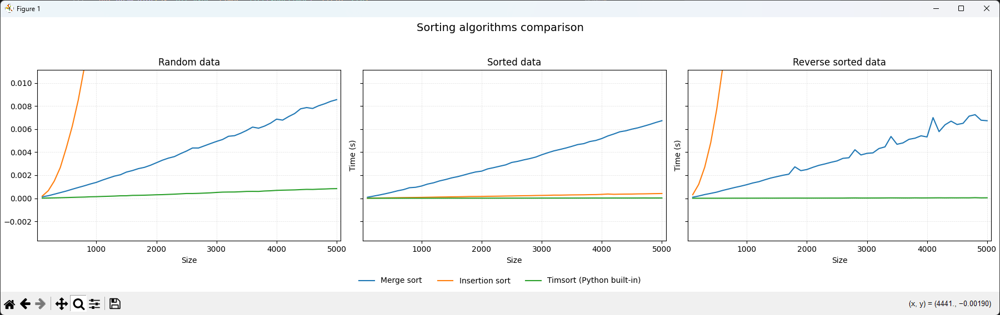

# goit-algo-hw-04

## Завдання 3. Порівняння алгоритмів сортування

У третьому завданні було порівняно три алгоритми сортування:

- сортування злиттям;
- сортування вставками;
- Timsort, тобто вбудований алгоритм Python, який використовується у `sorted()` та `list.sort()`.

Для вимірювання часу виконання використовувався модуль `timeit`. Алгоритми запускалися на масивах різного розміру та на різних типах вхідних даних:

- випадкові дані;
- вже відсортовані дані;
- дані, відсортовані у зворотному порядку.

Графік результатів збережено у файлі `result.png`.

Додатково збільшений фрагмент графіка збережено у файлі `zoomed_result.png`.

## Емпіричні результати

Щоб перевірити, до якої теоретичної складності ближче поводиться кожен алгоритм, було пораховано коефіцієнти кореляції з двома моделями:

- квадратична складність: `O(n^2)`;
- лінійно-логарифмічна складність: `O(n log n)`.

Чим ближче коефіцієнт до `1`, тим краще результати вимірювань відповідають відповідній моделі складності.

### Випадкові дані

| Алгоритм | Кореляція з `O(n^2)` | Кореляція з `O(n log n)` |
| --- | ---: | ---: |
| Merge sort | 0.9760 | 0.9997 |
| Insertion sort | 0.9998 | 0.9775 |
| Timsort | 0.9768 | 0.9993 |

На випадкових даних сортування злиттям і Timsort мають дуже високу кореляцію з `O(n log n)`. Сортування вставками, навпаки, найкраще відповідає квадратичній складності `O(n^2)`.

### Відсортовані дані

| Алгоритм | Кореляція з `O(n^2)` | Кореляція з `O(n log n)` |
| --- | ---: | ---: |
| Merge sort | 0.9743 | 0.9995 |
| Insertion sort | 0.9683 | 0.9989 |
| Timsort | 0.9527 | 0.9885 |

На вже відсортованих даних сортування вставками працює значно краще, ніж на випадкових або зворотно відсортованих даних, оскільки майже не виконує перестановок. Як видно на збільшеному графіку `zoomed_result.png`, у цьому випадку `insertion_sort` виконується швидше за `merge_sort`, але все одно поступається Timsort. Timsort також ефективно використовує те, що дані вже впорядковані.

### Зворотно відсортовані дані

| Алгоритм | Кореляція з `O(n^2)` | Кореляція з `O(n log n)` |
| --- | ---: | ---: |
| Merge sort | 0.9731 | 0.9990 |
| Insertion sort | 0.9994 | 0.9766 |
| Timsort | 0.9639 | 0.9921 |

На зворотно відсортованих даних сортування вставками знову демонструє поведінку, близьку до `O(n^2)`, тому що кожен новий елемент доводиться переміщувати через значну частину вже обробленого масиву. Merge sort і Timsort залишаються ближчими до `O(n log n)`.

## Висновки

Емпіричні результати підтверджують теоретичні оцінки складності алгоритмів.

Сортування злиттям стабільно показує поведінку, близьку до `O(n log n)`, незалежно від початкового порядку елементів. Це очікувано, оскільки алгоритм завжди ділить масив на частини та об'єднує їх у відсортованому порядку.

Сортування вставками має квадратичну складність `O(n^2)` на випадкових і зворотно відсортованих даних. На вже відсортованих даних воно працює набагато швидше, тому що кількість переміщень мінімальна. У цьому сценарії воно може бути швидшим за сортування злиттям, але оптимізований Timsort усе одно показує кращий результат.

Timsort показує найкращу практичну ефективність серед розглянутих алгоритмів. Він поєднує ідеї сортування злиттям та сортування вставками: ефективно працює з великими масивами, але також добре використовує вже впорядковані частини даних. Саме тому вбудовані алгоритми Python зазвичай варто використовувати замість власноруч написаних реалізацій сортування.

Отже, для практичного використання найкращим вибором є `sorted()` або метод `list.sort()`, оскільки вони реалізують оптимізований Timsort і працюють швидко на різних типах вхідних даних.
